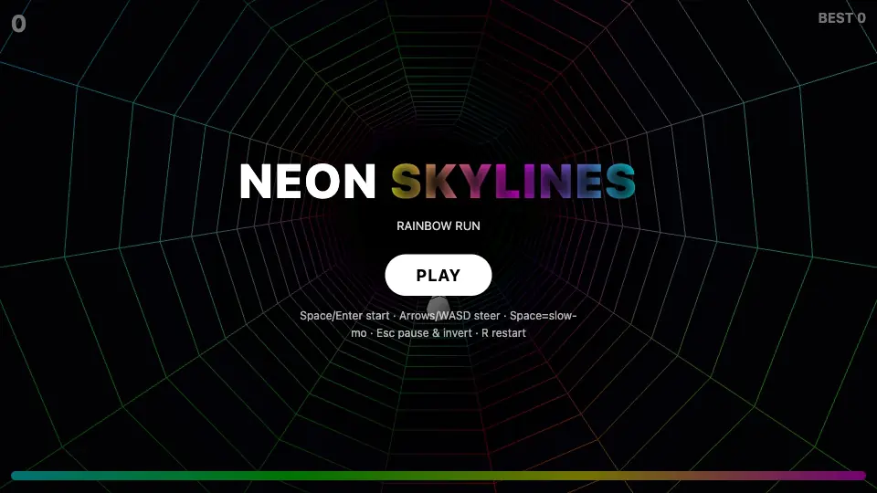

[](https://js13kgames.com/)
[](https://github.com/features/copilot)


Created for [js13kGames](https://js13kgames.com/) competition.
**Theme:** Rainbows and Unicorns. **Constraint:** web only, <= 13KB.

# Prism Drift

<p align="center">
  <a href="https://htmlpreview.github.io/?https://github.com/leereilly/prism-drift/blob/HEAD/index.html">
    
  </a>
</p>

A browser game built for [js13k](https://js13kgames.com/). Fly through a neon tunnel, dodge the walls, and collect notes to add layers to the music.

Open `index.html` in a browser with WebGL support. No install or build step.

### [🌈 Play now →](https://htmlpreview.github.io/?https://github.com/leereilly/prism-drift/blob/HEAD/index.html)

## Controls

- **Start:** Space or Enter
- **Steer:** Arrow keys or WASD
- **Slow motion:** Hold Space while flying
- **Pause/resume:** Esc or P
- **Restart:** R
- **Invert axes:** Pause, then toggle left/right or up/down inversion

## Features

- A twisting, deforming rainbow tunnel with momentum-based flight and a trailing chase camera
- Collectible notes that temporarily add percussion and synth layers to the procedural Web Audio soundtrack
- An energy-limited slow-motion mode for navigating tight turns
- A score-driven difficulty curve that increases flight speed and music tempo
- HUD indicators for score, best score, active music layers, and slow-motion energy
- Keyboard, pointer, and touch controls with persistent axis-inversion settings

## Development

Requires a modern web browser and Python 3.7+ for local serving.
Regression tests additionally require Node.js 18+.

The game is a single self-contained `index.html`; no dependencies need installing.
Serve it locally, then open <http://localhost:8000>:

```sh
python3 -m http.server 8000
```

Run the regression harnesses with:

```sh
node _fit_test.js
node _flight_test.js
node _music_test.js
```

The files in `assets/` are README-only media and are not part of the game or
competition submission.

## Contributing

Contributions welcome! This was a short-lived competition project, so ongoing
maintenance isn't guaranteed. Feel free to fork it and make it your own.

## License

MIT.
